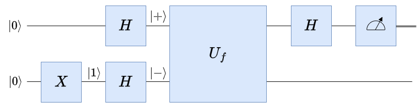
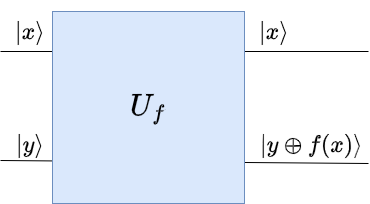

# Overview

A set of minimal and beginner-friendly implementations
of quantum-computing algorithms based on qiskit.
We use statevectors and require no backend access to a real QPU or a simulator.

Currently implemented:
- Deutsch Algorithm
- Deutsch-Jozsa Algorithm for two-bit input functions
- Bernstein-Vazirani Algorithm
- Phase Kickback
- Quantum Fourier Transform (QFT) demonstration (n = 4 / N = 16)
- Quantum Phase Estimation (QPE) using a single qbit
- Amplitude Amplification for a single solution
- Variational Quantum Eigensolver (VQE) for up to 3 qbits

# Installation

Python and qiskit are required to run the scripts.  Follow IBM's
installation guide on
https://quantum.cloud.ibm.com/docs/en/guides/install-qiskit.

# Algorithms and Usage

## Deutsch Algorithm

The Deutsch Algorithm is the simplest algorithm to demonstrate the
quantum computer's advantage.  It categorizes one-bit-input
one-bit-output functions into two subsets: functions with constant
output (e.g., $f(x) = 1$) and functions with balanced output (e.g., $f(x)
= x$).  Given an unknown function as a challenge, a classical computer
has to evaluate the function twice for the categorization
task. Contrary, the Deutsch Algorithm on a quantum computer requires
only one evaluation. This is a quantum query algorithm. Algorithms
based on the query model provide an oracle with input and obtain the
corresponding output of the function. In the quantum variant, the
oracle function is unitary. In both cases, the oracle is opaque to the
algorithm evaluating it.

The figure shows a schematic overview of our implementation for the
Deutsch Algorithm. Without presenting a detailed analysis, we point
out that we use an Pauli $X$ Gate to flip the lower bit and $H$
(Hadamard) gates to prepare qbits in states $\vert +\rangle$ and $\vert
-\rangle$, respectively. These qbits are in superposition states. This
is one of the key enablers which allows the Deutsch algorithm to
categorize the function with only one query. The other enabler is the
phase-kickback phenomenon, which we will cover below.  The output to
decide on whether $f(x)$ is balanced or constant is provided by
measuring the upper qbit. The lower qbit is not of interest and can be
discarded.



The oracle for the function $f(x)$, which is opaque to the algorithm
except for input and output, is implemented by the unitary query gate
$U_f$, as shown in the figure below. Denoting its inputs as $\vert
x\rangle$ and $\vert y\rangle$, resp., we obtain the outputs $\vert
x\rangle$ and $\vert y \oplus f(x)\rangle$. Note that the unitary
query gate is information preserving.



Our implementation lets the user pick a challenge to the algorithm
from these four functions: $f(x) = 0$, $f(x) = 1$, $f(x) = x$,
$f(x) = \bar{x}$.  The script will prepare the oracle representing
the selected function and the algorithm will evaluate it once. Based
on the outcome it will report "constant output" or "balanced output".


Run the script using
```
python deutsch.py
```

## Deutsch-Jozsa Algorithm for two-bit input functions

The Deutsch-Jozsa Algorithm can be understood as an extension of the
Deutsch Algorithm to binary functions with multiple input bits and one
output bit. Again, the algorithm will categorize the function as
"constant output" or "balanced output" with only one evaluation of the
oracle function (quantum query model). In this case, we are promised
that the function is either constant or balanced. Functions which
fulfill neither of these two properties are out of scope.

Our implementation is currently restricted to two input bits. The user
can choose from the following functions to challenge the algorithm:
'f(x0,x1) = 0', 'f(x0,x1) = 1', 'f(x0,x1) = x0', 'f(x0,x1) = x1',
'f(x0,x1) = not x0', 'f(x0,x1) = not x1', 'f(x0,x1) = x0 xor x1',
'f(x0,x1) = not(x0 xor x1)'.  The script will prepare the oracle
representing the selected function and the algorithm will evaluate it
once. Based on the outcome it will report "constant output" or
"balanced output".

Run the script using
```
python deutsch-jozsa.py
```

## Deutsch-Jozsa algorithm applied to Bernstein-Vazirani Problem

The Bernstein-Vazirani Problem demonstrates the advantage of quantum
computers by efficiently recovering a secret bitstring s of length
n. It achieves this by using the Deutsch-Jozsa algorithm for a special
oracle function, namely XOR_{i=0}^{n-1}(x_i * s_i) exactly once. This
is remarkable, as a classical algorithm would require n evaluations of
the function.

Our implementation lets the user enter a secret binary string and
builds the corresponding oracle which is opaque to the
algorithm. After evaluating the oracle once, the algorithm will
recover the correct bitstring.  We suggest to start with strings of 8
bits length and increase the length step by step.

Run the script using
```
python bernstein-vazirani.py
```
## Phase Kickback

Phase kickback refers to the effect that, in a controlled unitary
operation, a function applied to the target qubit "kicks back" a
function-dependent phase value onto the control qubit. This happens if
the target qbit is an eigenvector of the unitary query gate that
implements the function of interest. This allows phase information to
be encoded in control qubits. It is an important phenomenon and is
used in algorithms such as the Deutsch-Josza algorithm.

Our implementation does not apply a Hadamard gate after the query gate
and explicitly shows the phase applied to the controlling qbit's
states |0> and |1>. It lets the user choose the function to be
implemented by the unitary from this list: 'f(x) = 0', 'f(x) = 1',
'f(x) = x', 'f(x) = not_x'. The key insight is that the resulting
state reads 1/sqrt(2) * ((-1)^{f(0)}|0> + (-1)^{f(1)}|1>). Informally
speaking, the function values f(0) and f(1) "kick back" into the phase
of |0> and |1> state, respectively.

Run the script using
```
python phase_kickback.py
```

## Quantum Fourier Transformation (QFT)

Quantum Fourier Transformation (QFT) is the Discrete Fourier
Transformation (DFT) used as a quantum operation. It works on qbits
and is of practical interest due to two reasons: It is used as a
component in many emerging real-world applications, and moreover, it
requires lower complexity than both DFT and Fast Fourier
Transformation (FFT).

Our implementation uses n = 4 qbits and lets the user choose from four
input signals to illustrate the basic correspondences of QFT. There
are two signals with amplitude spikes, which will be transformed to a
superposition of uniform amplitude and a phase ramp with constant step
size. The other two possible input signals are uniform superpositions
with a phase ramp of constant step size. These input signals will
result in amplitude spikes at the output of the QFT.

Run the script using
```
python qft.py
```

## Quantum Phase Estimation (QPE)

Similar to QFT, Quantum Phase Estimation (QPE) is an algorithm of high
interest as it serves as a component in many quantum algorithms which
are becoming increasingly popular (e.g. Shor's Algorithm or Quantum
Counting). In essence, QPE is used to estimate the phase associated
with an eigenvalue of a unitary operator by encoding it into a quantum
state and extracting it via interference and measurement.
Note: QPE makes use of the phase kickback phenomenon.

In our implementation we choose the controlled-phase gate as the
easiest easy example of a unitary operator. We prepare the target qbit
in |1> state, which is an eigenstate of this operator. The user can
choose the angle the operator applies in the range [0;pi[ and observe
how QPE uses the probabilities of the controlling qbits state vector
to infer the angle.  Note that it is the limited range of the angle
which simplifies the problem such that it can be solved with a single
controlling qbit without ambiguity. The problem becomes much more
interesting and real without this limitation. In that case the number
of qbits, along wih repeated application of the operator, determine
the precision with which the phase can be estimated.

Run the script using
```
python qpe_single_qbit.py
```

## Amplitude Amplification

Amplitude Amplification is an iterative search algorithm that
alternates between an oracle, which marks the searched / good states
via a phase flip, and a diffusion operator, which amplifies their
amplitudes by reflecting the state about the average. Assuming only
one good state, this operation can be understood as a rotation towards
that state in sqrt(N) steps, with N being the total number of
states. Compared to classical search algorithms, Amplitude
Amplification provides a quadratic speedup (O(sqrt(N)) over O(N)).

Our implementation uses exactly one good state (the "solution") that the user
defines. It shows the probabilities of the qbit states over the
iterations and stops when the algorithm converges to a specific state
or the maximum number of iterations is reached.

Note that Amplitude Amplfication uses a generalization of the
technique used in Grover's algorithm. This technique is reflection on
two lines (which is in fact a rotation).

Run the script using
```
python amplitude_amplification.py
```

## Variational Quantum Eigensolver (VQE)

A Variational Quantum Eigensolver (VQE) is a hybrid quantum-classical
algorithm that finds the minimum energy (ground state) of a
Hamiltonian.  It is widely used in applications such as quantum
chemistry and drug discovery. VQE’s potential quantum advantage lies
in using a quantum system to efficiently represent and measure
properties of states that would be exponentially costly to simulate
classically.

Our implementation uses random search and is limited to 3 qubits. We
compute the exact ground state for comparison, track the VQE energy over
iterations, and report the relative error. The Hamiltonian is specified
as a sum of Pauli terms, and depending on whether complex coefficients
are present, we choose either a real-valued ansatz or a complex-valued
extension.

Run the script using
```
python vqe.py
```
